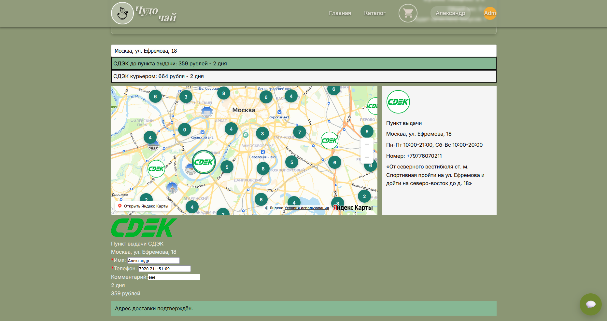

# Контакты

В случае проблем с компонентов писать сюда:
https://t.me/HoneyLime1


# Инструкция

1. 
```cmd
npm install react-dadata
```
2. Скачиваете репозиторий, вставляете файлы в свой проект и импортируете как компоненты.
3. Передаете данные по примеру ниже.


# Использование Frontend

```jsx
import { EShopLogistic } from "../components/EShopLogistic";

export function DeliveryBlock() {
  const [deliveryData, setDeliveryData] = useState(null);

  // Оформление заказа
  const handlePlaceOrder = async () => {
    try {
      await fetch("/api/test", {
        method: "POST",
        headers: {
          "Content-Type": "application/json"
        },
        body: JSON.stringify({
          deliveryData
        }),
      });
    } catch (error) {
      console.error("Ошибка оформления доставки:", error);
    }
  };

  return (
    <>
      <EShopLogistic
        DADATA_TOKEN="ваш-dadata-token"
        ESHOPLOGISTIC_TOKEN="ваш-eshop-токен"
        YANDEX_API_KEY="ваш-yandex-api-key"
        orderWeight={1.2}
        onDeliveryConfirm={(deliveryData) => {
          setDeliveryData(deliveryData);
        }}
      />
      
      <button
        className="btn-pay"
        onClick={() => {
          handlePlaceOrder();
        }}
      >
        Оформить доставку
      </button>
    </>
  );
}
```


# Использование Backend

```js
const { createOrder } = require("./utils/CreateOrder");

const ESHOPLOGISTIC_TOKEN = "ваш-eshop-токен";

app.post('/api/test', async(req, res) => {
  const { id, deliveryData } = req.body;

  const ESHOPLOGISTIC_TOKEN = "ваш-eshop-токен";
  let companyData = {
    senderName: "ваше имя",              // string 	Имя
    senderPhone: "ваш номер",            // string 	Телефон
    senderCompany: "ваша компания",      // string 	Название компании
    
    pick_up: false, // boolean 	Забор груза от отправителя
    address: {      // заполняем если pick_up = true
      region: "",   // string 	Регион. Например: Московская область
      city: "",     // string 	Населённый пункт
      street: "",   // string 	Улица
      house: "",    // string 	Номер строения
      room: ""      // string 	Квартира / офис / помещение
    }
  };

  let orderData = {
    id: id,                     // string 	Идентификатор заказа на сайте.                 
    type: 1,                    // integer 	Тип заказа. Доступно 2 варианта: «1» - Интернет-магазин, «2» - Доставка.
    combine_places_apply: true, // boolean 	
                                // Объединить все грузовые места в одно.
                                // При этом внутри грузового места формируется список позиций для страховки.
                                // По умолчанию = false.
    total_weight: 0,            // double 	Вес, в кг.
    dimensions: "",             // string 	Габариты. Формат: строка вида «Д*Ш*В», в сантиметрах. Например: 15*25*10 .
    payment: "already_paid",    // string 	Способ оплаты
                                // Возможные варианты:
                                // already_paid - заказ уже оплачен,
                                // cash_on_receipt - наличными при получении,
                                // card_on_receipt - картой при получении,
                                // cashless - безналичный расчет
    places: [{            // array Нужно заполнить информацией о заказах 
        article: "",      // string 	Идентификатор товара / груза.
        name: "",         // string 	Название
        count: 1,         // integer 	Количество
        price: 100.5,     // double 	Цена, включая НДС
        weight: 0.15,     // double 	Вес, в кг.
        dimensions: "",   // string 	Габариты. Формат: строка вида «Д*Ш*В», в сантиметрах. Например: 15*25*10 .
        vat_rate: -1,     // integer 	Значение ставки НДС 
                          // Возможные варианты: 0, 5, 7, 10, 20, -1 (без НДС)
      }],
  };

  createOrder(ESHOPLOGISTIC_TOKEN, deliveryData, orderData, companyData);

  res.status(200).send('OK');
});
```

# Пример реализации
[https://чудочай.рф/checkout](https://чудочай.рф/checkout)



### Props

| Prop | Тип | Обязательный | Описание |
| --- | --- | --- | --- |
| `DADATA_TOKEN` | `string` | Да | Токен DaData для подсказок адресов. |
| `ESHOPLOGISTIC_TOKEN` | `string` | Да | Токен EShopLogistic для расчёта доставки в браузере. Не передавайте сюда секретный серверный токен, если он не предназначен для публичного клиента. |
| `YANDEX_API_KEY` | `string` | Да | Ключ API Яндекс.Карт/геокодера. |
| `orderWeight` | `number` | Да | Вес заказа в килограммах для расчёта доставки. |
| `onDeliveryConfirm` | `(deliveryData) => void` | Да | Callback, который вызывается после подтверждения доставки пользователем. И передает данные доставки необходимые в CreateOrder для создания заказа. |


## Серверная функция `createOrder`

`createOrder` создаёт заказ доставки через API EShopLogistic. Эту функцию нужно вызывать на сервере, а не в браузере, потому что она использует токен создания заказа.


### Сигнатура

```js
createOrder(ESHOPLOGISTIC_TOKEN, deliveryData, orderData, companyData)
```

| Параметр | Тип | Описание |
| --- | --- | --- |
| `ESHOPLOGISTIC_TOKEN` | `string` | Токен EShopLogistic для создания заказа. Передавайте его только на сервере. |
| `deliveryData` | `object` | Данные выбранной доставки: служба, тип доставки, адрес/терминал, цена, получатель, комментарий. |
| `orderData` | `object` | Данные заказа: id, товары/грузовые места, вес, габариты, оплата. |
| `companyData` | `object` | Данные магазина/отправителя и адреса отправки. |